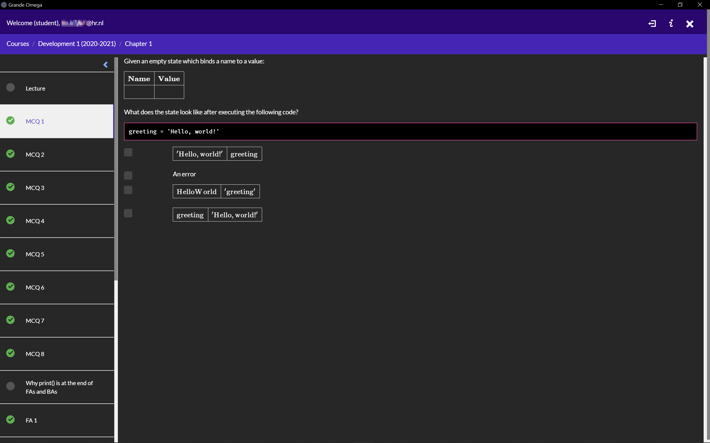
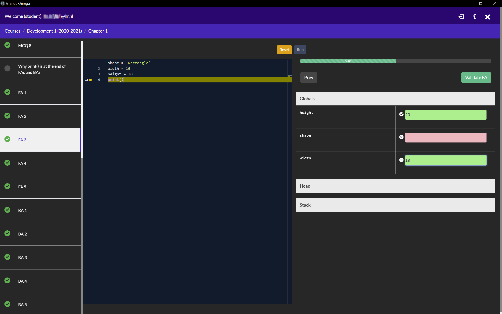
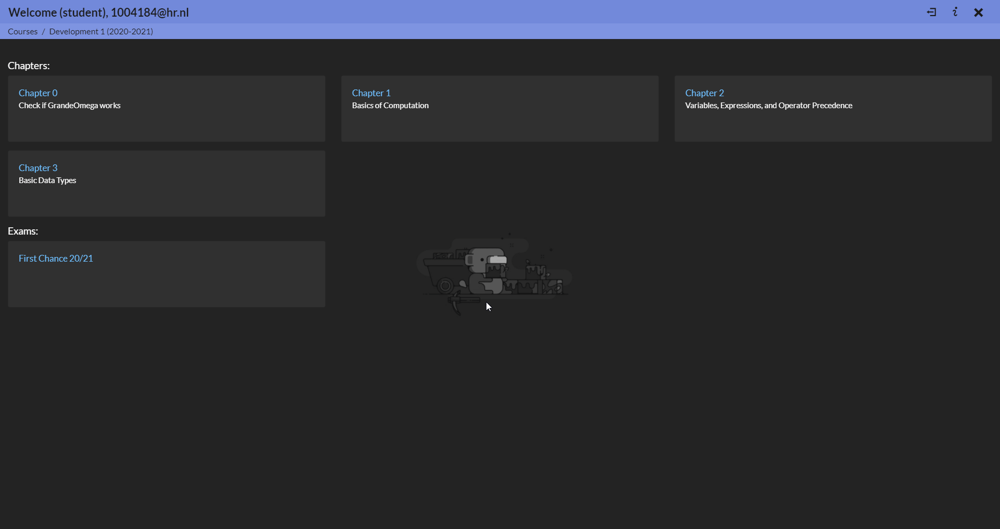

<!-- @format -->

# (HR) Grande Omega Skins

This is an unofficial dark mode patch for Grande Omega. It changes and adds some files to make Grande Omega appear in dark mode.
This is a collection of unofficial skins for Grande Omega. It changes and adds some files to make Grande Omega appear in your prefered skin.

**Use at your own risk, I'm not responsible for any errors, bugs, or other stuff you might run into**
**You're not allowed to use any of the thenes during exams / tests, make sure you have a clean copy!**

## Themes

### Fox Dark - Foxxite

### Wumpus Dark - VAC Efron

## Installation

Download the repo using the "**↓** Code" button and select the ZIP file.
Make a **copy** of the resource folder in the Grande Omega folder.

In the zip file go to the folder **themes** and pick a theme you want to use.

### Steps Normal Version

Extract the contents of the theme folder from the zip file **on top** of your Grande Omega directory.

### Steps Auto Updater

Go into the folder of you chosen theme until you find the files and folders `index.html, main.js (not always included) and wwwroot`.
Extract these files **on top** of `Grande_Omega\tmp\`.

---

Replace the files you get asked to replace.
Next time you start grande Omega it should appear in your chosen theme.

To change theme, restore the recourse folder from the copy you made and repeat the installation steps.

## Contributing

Fork this repo and clone it to your workspace.

Create your own theme by making a folder for your theme in the themes folder.
Add screenshots of your theme to this ReadMe file.

Create a pull request on this repo with a branch sharing the name of your theme.
Once your theme has been approved it will be merged into the master branch.

If you haven't already setup signed commits, these look nicer :)

Any themes that **edit any non CSS (except index.html and main.js)** files will be declined.

### Dev Tools

To get access to the dev tools, replace the 

**Normal Version**: `Grande_Omega\resources\app\desktop\Student\main.js` 

**Auto Updater Version**: `Grande_Omega\tmp\main.js` 

file with the one found in the root of the repo.
